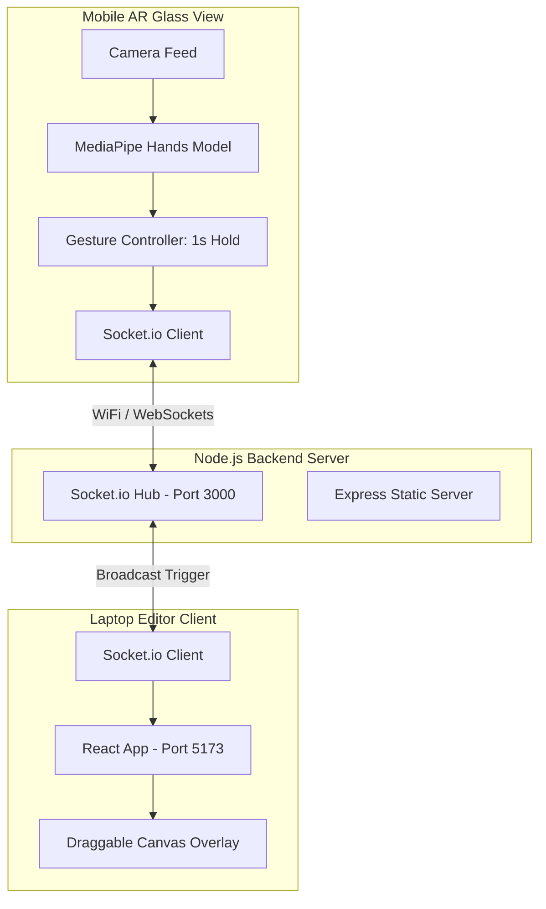

# 🚀 NoteSense (AR Glass Simulator to Laptop Note Sync PoC)

> **Galaxython PoC Project**  
> An immersive, markerless AR-to-Laptop lecture notes ecosystem. Capture whiteboard schematics with a finger-pinch gesture and slide them onto your laptop notes as interactive, draggable stickers.

---

## 💡 Concept Overview

NoteSense bridges the gap between physical lectures and digital note-taking by replacing traditional scanners or manual sketching with an intuitive AR HUD interaction. 

*   **Glass/Phone (Capture Device)**: Simulates an AR Glass interface running in landscape. Using MediaPipe on-device hand-tracking, the camera identifies the user's index finger tip. Holding the finger still over any diagram for 1 second clips the asset.
*   **Laptop (NoteSense Client)**: A Notion-style Light Mode lecture note editor. It receives the pasted drawings in real-time via Socket.io and renders them as absolute-positioned, floating stickers that can be dragged anywhere or deleted.

---

## 🛠️ Architecture & Tech Stack



*   **Frontend**: React (Vite), custom premium light-mode styling system.
*   **Computer Vision**: `MediaPipe Hands` (real-time, on-device index-finger coordinate tracking and velocity check).
*   **Real-time Communication**: `Socket.io` client-server relay.
*   **Backend**: Node.js, `Express.js`, `Socket.io` server.
*   **Proxy & SSL**: Vite reverse-proxies socket traffic to bypass mixed content blocks, and uses `@vitejs/plugin-basic-ssl` to run secure HTTPS local servers required by mobile browsers for camera API access.

---

## ✨ Key Features

1.  **Forced Landscape AR HUD**: Configured with CSS transforms to force-rotate the phone screen 90° sideways when in portrait mode. It bypasses mobile Orientation Lock systems to ensure a horizontal AR Glass viewport.
2.  **Toggle Fullscreen**: A glassmorphic HUD button triggers HTML5 Fullscreen APIs to slide away Chrome/Safari URL address bars, giving a native-app feel.
3.  **Markerless Gesture Flow (Copy $\rightarrow$ Sleep $\rightarrow$ Paste)**:
    *   **Copy**: Point at any blackboard target. Hold index finger still for **1 second** (Cyan progress circle). The graph copies and floats above the finger tip.
    *   **Invisible Cooldown (Sleep)**: Locks scanning for **2 seconds** after copy to prevent accidental triggers.
    *   **Paste**: Point phone camera at your laptop. Hold finger still *anywhere* in the frame for **1 second** (Violet progress circle). The graph automatically pastes to the editor.
    *   **Lock-after-Paste**: Locks triggers for **5 seconds** after paste to let you retract your hand safely.
4.  **Interactive Stickers**: Pasted lecture graphs appear inside NoteSense as absolute-positioned cards. They support mouse drag-and-drop dragging and include a close (`×`) delete button.
5.  **Fail-Safe Keyboard Shortcut (`P` key)**: Pressing `P` on the laptop keyboard (when not writing text) instantly spawns the graphic sticker. **Excellent for mock demonstrations during video recordings.**

---

## 🏃 Getting Started

### 1. Installation
Navigate to the directory and install dependencies:
```bash
cd poc-galaxy
npm install
```

### 2. Run the Development Server
Start both the Node.js socket server (port 3000) and the Vite HTTPS dev client (port 5173):
```bash
npm run dev
```

### 3. Open Laptop Client
On your laptop, open:
```
https://localhost:5173
```
*Accept the self-signed SSL certificate warning if prompted.*

### 4. Connect Phone Client
1. Find your laptop's local IP address (printed on your terminal and in the left sidebar of the NoteSense editor, e.g. `192.168.0.15`).
2. Open the URL on your mobile browser:
   ```
   https://<YOUR-LAPTOP-IP>:5173/#phone
   ```
3. Bypass the SSL certificate warning (*Advanced* $\rightarrow$ *Proceed*), grant camera permissions, and click **"전체화면 켜기"** to hide the URL bars.

---

## 🎮 How to Demo

1.  **Blackboard Target**: Open `/rlc_board.png` (located in the `public` directory) on your laptop in a separate window.
2.  **Copy Diagram**: Point the phone at this board. Bring your index finger into the frame and hold it still. Once the **cyan circle** completes, the graph (`rlc_graphic.png`) will attach to your finger.
3.  **Paste onto Laptop**: Turn to your NoteSense editor page. Point your finger anywhere in the screen frame. Once the **violet circle** completes, the diagram will slide onto your laptop note.
4.  **Position Sticker**: Use your laptop mouse to drag the diagram sticker to any margin, or close it using the top-right `×` button.
5.  *Video Demo Shortcut*: During video recording, you can simply press the **`P`** key on your laptop keyboard to simulate the paste instantly.
